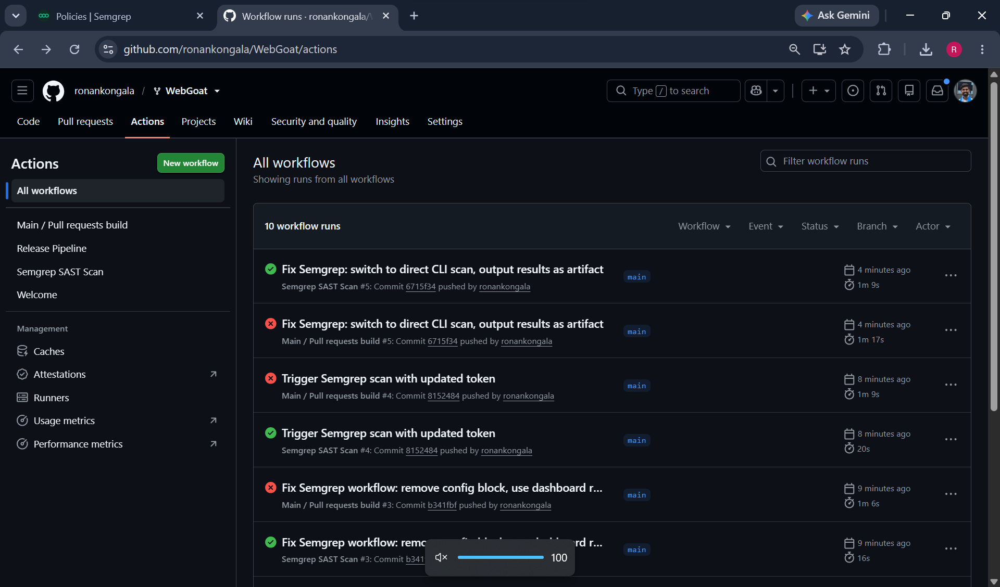
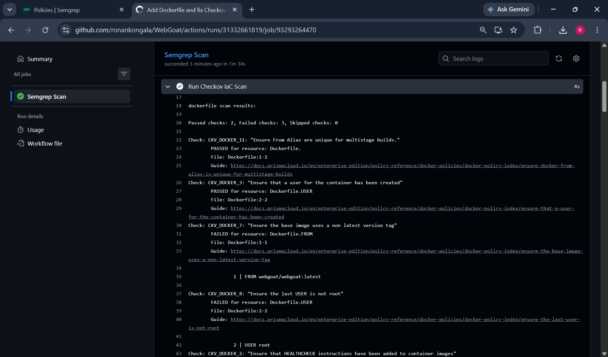
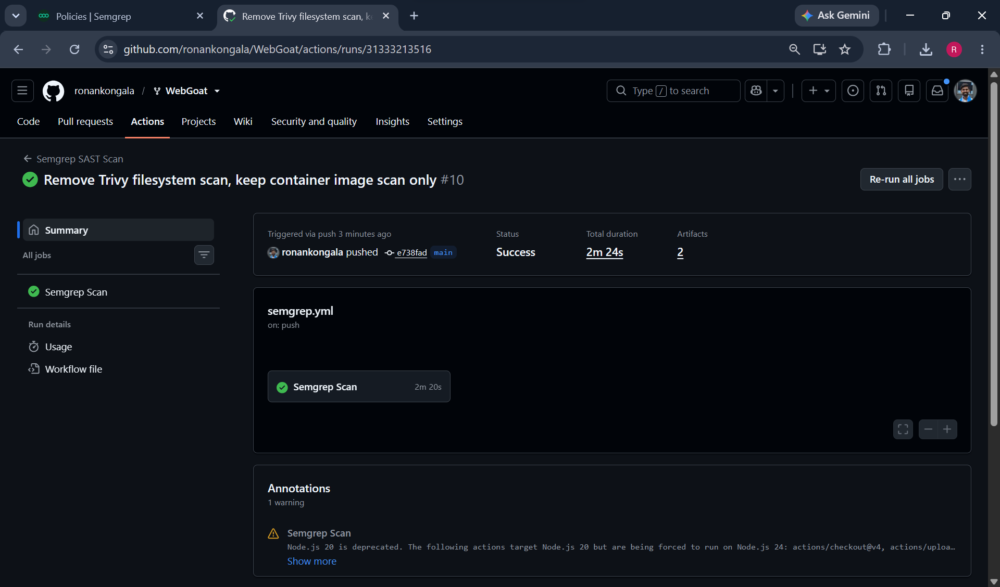
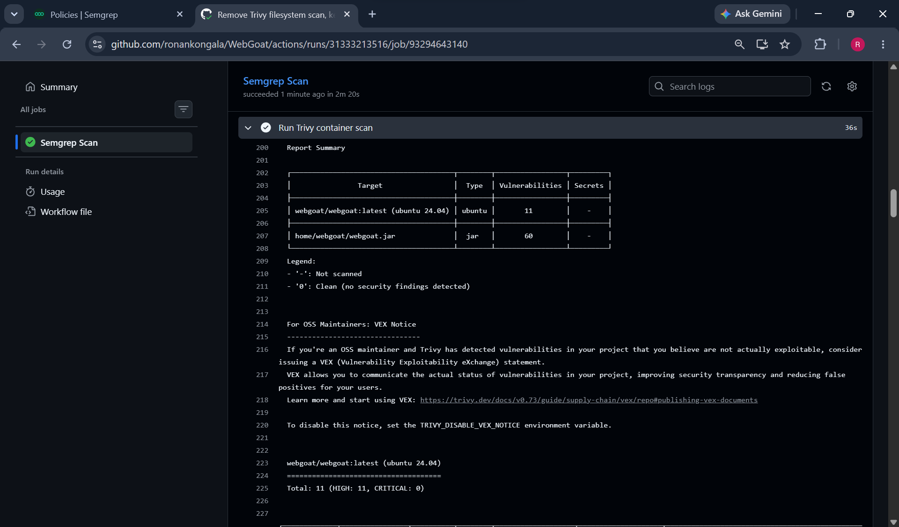
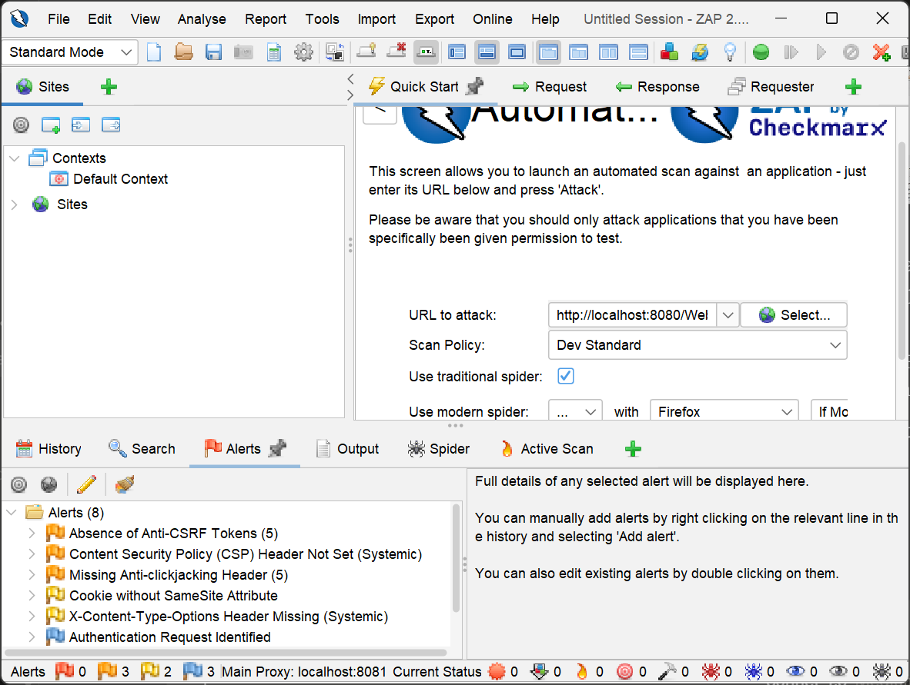
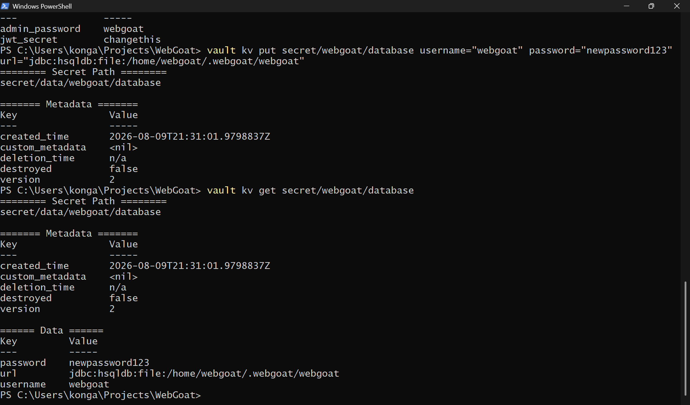
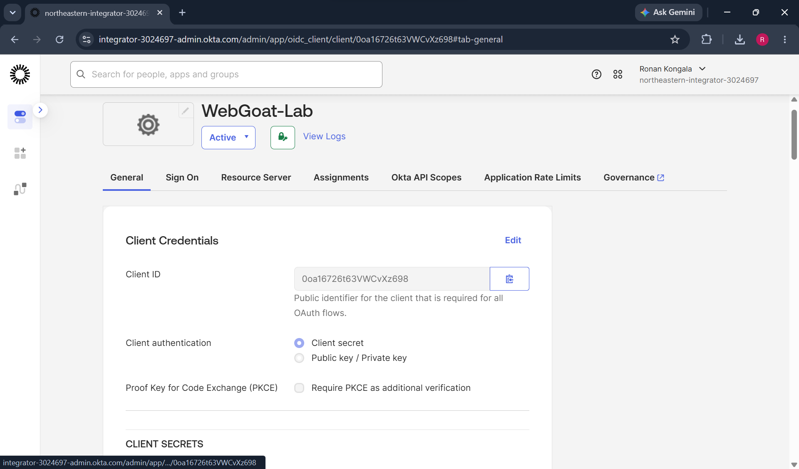

# Application Security Pipeline + Secrets Management Lab

A hands-on AppSec lab wrapping a deliberately vulnerable web application (OWASP WebGoat) with a 3-gate CI/CD security pipeline, container image scanning, DAST scanning, secrets management, and SSO/MFA — mapped against PCI-DSS 4.0 requirements.

**Live repo:** github.com/ronankongala/Appsec-pipeline-lab  
**Status:** Complete  
**Stack:** Terraform · GitHub Actions · Semgrep · Checkov · Trivy · OWASP ZAP · HashiCorp Vault · Okta OIDC

---

## Architecture

```
Developer Push
      ↓
GitHub Actions CI/CD (.github/workflows/semgrep.yml)
      ↓
┌─────────────────────────────────────┐
│  Security Gate                      │
│  1. Semgrep SAST  — 66 findings     │
│  2. Checkov IaC   — 3 failures      │
│  3. Trivy image   — 71 CVEs         │
└─────────────────────────────────────┘
      ↓
WebGoat container (Terraform · Docker)
      ↓
OWASP ZAP DAST    — 8 alerts
      ↓
HashiCorp Vault   — secrets at rest
      ↓
Okta OIDC         — SSO + MFA
```

---

## Tools and Skills

| Tool | Purpose | New Skill |
|---|---|---|
| Terraform (Docker provider) | Infrastructure as Code — container lifecycle managed declaratively | ✅ |
| Semgrep | SAST — source code scanning with OWASP Top 10 and security-audit rulesets | ✅ |
| Checkov | IaC scanning — Dockerfile misconfigurations mapped to Prisma Cloud policy IDs | ✅ |
| Trivy | Container image scanning — CVE detection in OS layers and JAR dependencies | ✅ |
| OWASP ZAP | DAST — active scan against running WebGoat, 961 requests, 8 vulnerability categories | ✅ |
| HashiCorp Vault | Secrets management — KV engine, secret versioning, rotation demo | ✅ |
| Okta OIDC | SSO + MFA — Authorization Code flow, WebGoat-Lab app integration | ✅ |
| GitHub Actions | CI/CD pipeline — 3 security gates wired to block on critical findings | existing |
| Docker | Container runtime — WebGoat deployed and managed via Terraform | existing |

---

## Key Findings

### Semgrep SAST — 66 findings



Scanned 1,002 files with 662 rules across Java, JavaScript, HTML, YAML, Terraform, and Dockerfile. Findings include SQL injection patterns, insecure deserialization, XXE vulnerabilities, and mutable GitHub Actions tags enabling supply chain attacks.

---

### Checkov IaC — 3 failures



- `CKV_DOCKER_7` — base image uses `:latest` tag instead of pinned digest
- `CKV_DOCKER_8` — container last USER is root
- `CKV_DOCKER_2` — no HEALTHCHECK instruction

---

### CI/CD Pipeline — All Gates Green



Full pipeline passing in 2m 20s. Semgrep, Checkov, and Trivy all completed successfully with results uploaded as artifacts.

---

### Trivy Container Scan — 71 CVEs



- Ubuntu 24.04 base layer: 11 HIGH CVEs
- `webgoat.jar` dependencies: 60 vulnerabilities

---

### OWASP ZAP DAST — 8 alerts



- Absence of Anti-CSRF Tokens (5 instances)
- Content Security Policy Header Not Set
- Missing Anti-Clickjacking Header (5 instances)
- Cookie without SameSite Attribute
- X-Content-Type-Options Header Missing

---

### HashiCorp Vault — Secret rotation (v1 → v2)



App credentials stored in Vault KV engine at `secret/webgoat/database` and `secret/webgoat/app`. Secret rotation demonstrated — database password updated, version counter incremented from 1 to 2.

---

### Okta OIDC — SSO + MFA



`WebGoat-Lab` OIDC web app integration in Okta with Authorization Code flow, sign-in redirect to `http://localhost:8080/WebGoat/callback`, and MFA enforced via Okta Verify.

---

## Phase Walkthrough

### Phase 1 — Target Application
Deployed OWASP WebGoat via Docker. WebGoat is a deliberately insecure Java/Spring Boot application covering all OWASP Top 10 vulnerability categories. Verified app reachability via CLI (`Invoke-WebRequest`) and browser, then registered a test user and confirmed all lesson categories loaded.

### Phase 2 — Infrastructure as Code
Provisioned the WebGoat container using Terraform's `kreuzwerker/docker` provider. The container is now fully managed as code — port bindings, restart policy, and image reference all declared in `terraform/main.tf`. Running `terraform apply` brings the environment up reproducibly from scratch.

### Phase 3 — CI/CD Security Pipeline
Built a GitHub Actions pipeline (`semgrep.yml`) with three security gates that trigger on every push to `main`:

1. **Semgrep SAST** — scans source code with `p/owasp-top-ten` and `p/security-audit` rulesets; results saved as a JSON artifact
2. **Checkov IaC** — scans `Dockerfile` with the Prisma Cloud policy library; 3 real misconfigurations flagged with CKV policy IDs and remediation links
3. **Trivy container scan** — scans `webgoat/webgoat:latest` image layers and JAR dependencies for CVEs; 71 vulnerabilities identified

Pipeline runs in ~2m 20s. All scan results uploaded as GitHub Actions artifacts for review.

### Phase 4 — DAST Scanning
Ran OWASP ZAP 2.17.0 automated scan against the running WebGoat container (`http://localhost:8080/WebGoat`). 961 requests sent over a full active scan. Identified 8 vulnerability categories including missing CSRF protections, absent security headers, and insecure cookie configuration. Full HTML report saved to `docs/zap-report.html`.

### Phase 5 — Secrets Management + Identity
**HashiCorp Vault (dev mode):** Stored WebGoat database credentials and app secrets in Vault's KV secrets engine at `secret/webgoat/database` and `secret/webgoat/app`. Demonstrated secret rotation by updating the database password — version counter incremented from 1 to 2, confirming versioned secret history.

**Okta OIDC:** Created `WebGoat-Lab` OIDC web application integration in Okta (`northeastern-integrator-3024697` org). Configured Authorization Code flow with sign-in redirect to `http://localhost:8080/WebGoat/callback`. MFA enforced via Okta Verify on the org.

### Phase 6 — Compliance Mapping
Mapped the lab environment against 16 PCI-DSS 4.0 requirements spanning Requirements 2, 3, 6, 7, 8, 10, 11, and 12. Produced an accepted risk register documenting 6 intentional findings with justification. Full mapping in `docs/PCI-DSS-Control-Mapping.md`.

---

## Repository Structure

```
WebGoat/
├── .github/
│   └── workflows/
│       └── semgrep.yml          # 3-gate security pipeline
├── Dockerfile                   # Scanned by Checkov
├── terraform/
│   ├── main.tf                  # Docker provider + WebGoat container
│   └── .terraform.lock.hcl
└── docs/
    ├── screenshots/             # 23 phase screenshots
    ├── zap-report/              # OWASP ZAP HTML report
    └── PCI-DSS-Control-Mapping.md
```

---

## Compliance Coverage

16 PCI-DSS 4.0 requirements mapped. Key controls:

- **Req 6.2.4** — Semgrep SAST on every push (66 findings in WebGoat source)
- **Req 6.3.3** — Trivy CVE scanning in CI (71 CVEs identified)
- **Req 6.4.1** — ZAP DAST active scan (8 vulnerability categories)
- **Req 3.5.1** — Vault KV secrets engine (credentials not hardcoded)
- **Req 8.4.2** — Okta MFA enforcement (Okta Verify)

Full mapping: `docs/PCI-DSS-Control-Mapping.md`

---

## Author

**Ronan Kongala**  
MS Cybersecurity, Northeastern University  
[linkedin.com/in/ronan-kongala](https://linkedin.com/in/ronan-kongala) · [ronankongala.github.io](https://ronankongala.github.io)
